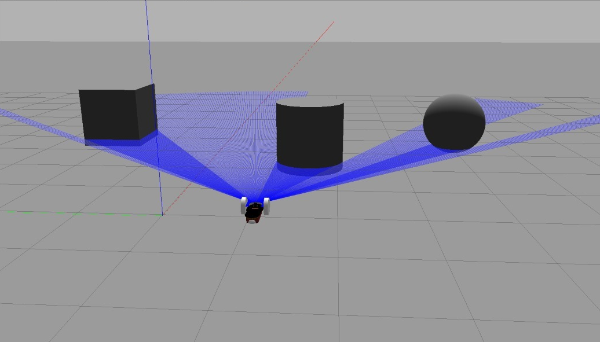

# 📦 Module: Custom Gazebo Robot

This simulation setup includes:

- `model.config` — Metadata for the robot model (name, author, description, version)
- `model.sdf` — Simulation Description Format file defining the robot's physical properties, links, joints, visuals, and sensors for use in Gazebo

### 🛠️ Usage Instructions

#### 1. Copy to Gazebo Model Path

To use this robot in Gazebo:

```bash
mkdir -p ~/.gazebo/models/<your_model_name>
cp model.config model.sdf ~/.gazebo/models/<your_model_name>/
```

#### Simulation result
