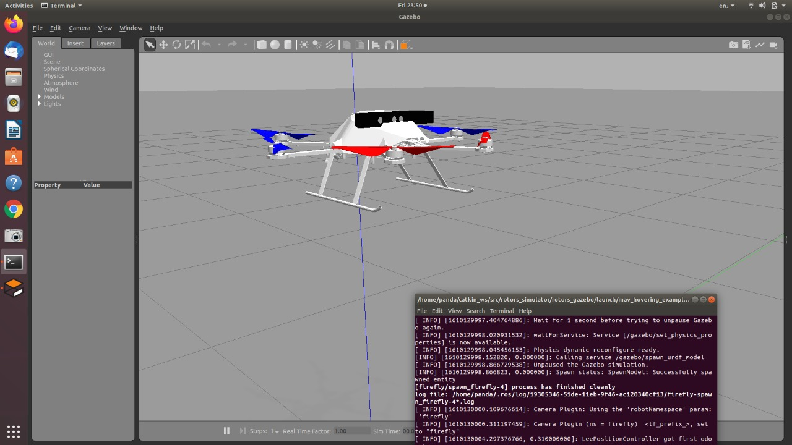

# 🚁 Firefly MAV Hovering Simulation

This project simulates a **Firefly drone** in a hovering state using ROS and Gazebo. It leverages XACRO for robot description and includes a ready-to-use launch file for bringing up the simulation.

---

## 📁 Contents

| File                          | Description                                                 |
|------------------------------|-------------------------------------------------------------|
| `firefly_base.xacro`         | Defines the drone structure using XACRO (macro-based URDF)  |
| `mav_hovering_example.launch`| Launches the drone in Gazebo with hover control plugins     |

---

## 🚀 Getting Started

### Prerequisites

- ROS (Noetic / Melodic)
- Gazebo simulator
- `robot_state_publisher`, `gazebo_ros`, `mavros` packages installed

---

### 🔧 How to Launch

1. Clone the repository and source your workspace:

```bash
cd ~/catkin_ws/src
git clone https://github.com/<your-username>/rosSimverse.git
cd ~/catkin_ws && catkin_make
source devel/setup.bash
```

#### Simulation Result
